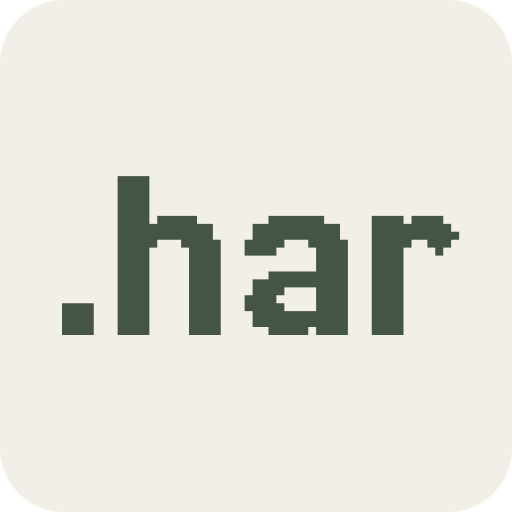
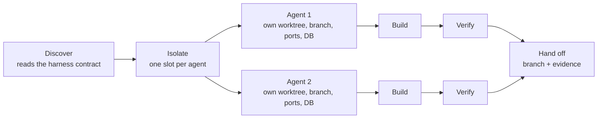

<p align="center">
  
</p>

# HAR: The open harness for multi-agent coding workflows

[](https://github.com/os-factory/har/releases)
[](https://github.com/os-factory/har/actions/workflows/test.yml)
[](https://harproject.dev/)

HAR is an open-source, agent-agnostic framework for building multi-agent coding workflows. Run a fleet of coding agents in parallel on any repository, with deterministic validation gates, verifiable proof, and full observability across every agent, all extensible and customizable to your own workflow and tooling.

<table align="center">
  <caption>▶ <strong>Introduction demo</strong> — click the thumbnail to watch on YouTube</caption>
  <tr>
    <td align="center">
      <a href="https://youtu.be/XKl4ZzWy7mQ">
        
      </a>
    </td>
  </tr>
</table>

Works with **Claude Code** · **Cursor** · **Codex** · any MCP agent.

## What's included out of the box

- **HAR.** The core harness, available as both a CLI and an MCP server. It turns any repository into isolated worktrees with deterministic launch, verify, and teardown stages for coding agents to work in.
- **Mission Control.** HAR's open-source local dashboard. It gives you one place to keep track of every repository, worktree, run, validation, and artifact across your projects.
- **Plugins.** A growing ecosystem of open source plugins that further expand HAR's customizability and functionality.

## Install

```bash
npm install -g @osfactory/har
```

## Get started

```bash
cd my-app
har env init              # scaffold .har/ and print a prompt for your coding agent
har env launch 1          # isolated worktree + running stack for agent slot 1
har env verify 1 --full   # run the project's real checks, record what passed
```

Full walkthrough: [Quickstart](https://harproject.dev/docs/getting-started/quick-start/).

## Why HAR

Getting a single coding agent to work in a repo is easy. Scaling that into a real multi-agent workflow, where several agents run at once and humans still trust the output, is where it breaks down. HAR was built to close those gaps:

1. **No standard way to run or verify a repo.** That knowledge is scattered across a README, a CLAUDE.md, Cursor rules, and CI yaml today, drifting out of sync with each other and the actual codebase. HAR replaces all of that with one machine-readable contract (.har/) that Claude Code, Cursor, Codex, or any MCP agent reads the same way.

2. **Multiple agents on one repo collide.** Shared dev server, shared database, shared ports, conflicting git state. HAR gives each agent its own worktree, ports, and database per slot, so a fleet can genuinely run concurrently.

3. **Trusting an agent's change means re-verifying it yourself.** Every task runs the same deterministic verify step and leaves an evidence trail, logs, artifacts, a validated tree hash, so a reviewer can check proof of what ran instead of relying on the agent's self-report.

4. **One platform's sandbox locks you in.** If the contract lives inside a vendor's hosted dashboard, switching coding agents later means rebuilding the whole verification setup. HAR's contract is an open standard living in the repo itself, portable across whichever agent or tool you adopt.

5. **Hand-rolled scripts rot as the stack changes.** A new dependency, a new service, a new env var, and nobody updates the script until an agent's run fails for a confusing reason. `har env maintain` diffs your installed harness against current templates and flags drift before it causes a silent failure.

HAR coordinates the work around the model, so agents can focus on the code and reviewers can trust the result.

## How HAR works



1. **Discover.** The agent asks the harness what this project looks like, including its stack, its scripts, and what checks are available.

2. **Isolate.** Every task gets its own slot. That means a fresh copy of the repo on its own branch, with its own ports and, where the project needs it, its own database. Nothing is shared with the main checkout or with any other agent's slot.

3. **Build.** The agent edits and tests its work entirely inside that isolated copy. The main checkout stays untouched the whole time.

4. **Verify.** The project's own checks, whatever they are, run through the same pipeline every time and produce a consistent result. A full verification goes further and captures the state of the entire codebase at that moment, so a pass is tied to the exact code that was checked.

5. **Hand off.** Once verification passes, the session is torn down, but the branch and the proof of what ran are kept. A reviewer gets the code plus the evidence that it was checked.

## Documentation

Everything beyond install and first commands lives at [harproject.dev](https://harproject.dev/).

- **[Core concepts](https://harproject.dev/docs/getting-started/concepts/).** Defines the terms the rest of the docs rely on, things like harness, slot, worktree, stage, run, and validation.
- **[Agent integrations](https://harproject.dev/docs/guides/agent-integrations/).** How to install HAR workflows for Cursor, Claude Code, Codex, and other MCP clients.
- **[Verification and commit gate](https://harproject.dev/docs/guides/verification/).** How HAR binds a successful check to exact code and enforces that result at commit time.
- **[Plugins](https://harproject.dev/docs/guides/plugins/).** How to install framework-specific verification bundles, like Playwright and RocketSim, that register stages in your harness.
- **[CLI reference](https://harproject.dev/docs/reference/cli/).** Every command and option the `har` executable exposes.
- **[MCP tools](https://harproject.dev/docs/reference/mcp/).** The structured tools an MCP-connected agent calls directly, for discovery, session control, verification, and evidence.
- **[Mission Control](https://harproject.dev/docs/guides/mission-control/).** How to run the local dashboard that tracks repositories, worktrees, runs, validations, and artifacts.
- **[Architecture](https://harproject.dev/docs/project/architecture/).** HAR's internal layers, contracts, and extension points, for anyone building a plugin or contributing to the core.

## Contributing

See [CONTRIBUTING.md](./CONTRIBUTING.md) for local setup, the dogfood harness loop, and architecture. Coding agents working on this repo should start with [AGENTS.md](./AGENTS.md). Maintainer release process: [RELEASING.md](./RELEASING.md).

## Sponsors

HAR is sponsored by [Kerno](https://kerno.io), runtime code and security review for coding agents.

<p align="left">
  <a href="https://kerno.io">
    <picture>
      <source media="(prefers-color-scheme: dark)" srcset="assets/kerno-logo.svg">
      
    </picture>
  </a>
</p>

## License

Licensed under the [Apache License 2.0](./LICENSE).

## Security

Report vulnerabilities via [SECURITY.md](./SECURITY.md).
